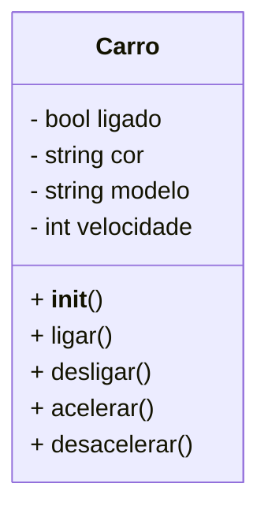

# 🏆 Classes e Objetos

# 🚗 .........................

## ✅ Requisitos

- 1️⃣ **Crie uma classe que modele o objeto "carro".**
- 2️⃣ **Um carro tem os seguintes atributos: ligado, cor, modelo, velocidade.**
- 3️⃣ **Um carro tem os seguintes comportamentos: liga, desliga, acelera, desacelera.**
- 4️⃣ **Crie uma instância da classe carro.**
- 5️⃣ **Faça o carro "andar" utilizando os métodos da sua classe.**
- 6️⃣ **Faça o carro "parar" utilizando os métodos da sua classe.**

## 🗺️ Diagrama UML da Classe Carro

> _**O diagrama UML acima ilustra a estrutura da classe Car e seus componentes principais:**_

**Atributos:**

- **is_activated:** Um atributo do tipo bool que indica se o carro está ligado (True) ou desligado (False).
- **color:** Um atributo do tipo string que define a cor do carro.
- **brand:** Um atributo do tipo string que especifica a marca do carro.
- **speed:** Um atributo do tipo int que representa a velocidade atual do carro.

**Métodos:**

- **__init__():** O construtor da classe que inicializa os atributos is_activated, color, brand, e speed.
- **turn_on():** Método que define is_activated como True, indicando que o carro está ligado.
- **turn_off():** Método que define is_activated como False, indicando que o carro está desligado.
- **speed_up():** Método que aumenta a velocidade (speed) do carro em 10 unidades, se o carro estiver ligado.
- **slow_down():** Método que diminui a velocidade (speed) do carro em 20 unidades, se o carro estiver ligado e a velocidade for maior que 0.

