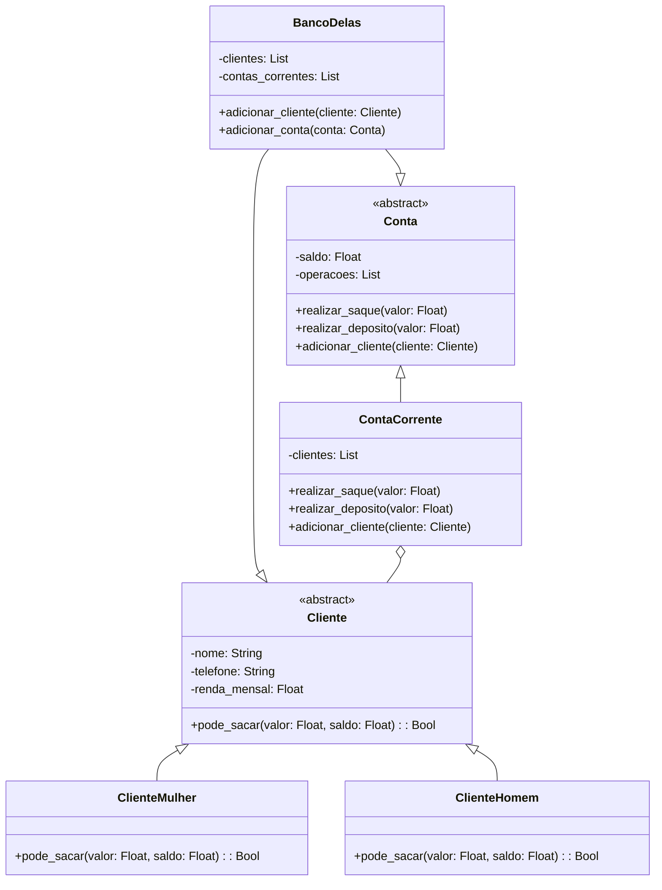

# 🏆 Exercícios Modelando um Sistema

🏦 🏦**O banco Banco Delas**🏦 🏦 é um banco moderno e eficiente, com vantagens exclusivas para clientes mulheres. Modele um sistema orientado a objetos para representar contas correntes do Banco Delas seguindo os requisitos abaixo:

- Cada conta corrente pode ter um ou mais clientes como titular.
- O banco controla apenas o nome, o telefone e a renda mensal de cada cliente.
- A conta corrente apresenta um saldo e uma lista de operações de saques e depósitos.
- Quando a cliente fizer um saque, diminuiremos o saldo da conta corrente. Quando ela fizer um depósito, aumentaremos o saldo.
- Clientes mulheres possuem em suas contas um cheque especial de valor igual à sua renda mensal, ou seja, elas podem sacar valores que deixam a sua conta com valor negativo até renda_mensal.
- Clientes homens por enquanto não têm direito a cheque especial.

> **Observação:** _Para modelar seu sistema, utilize obrigatoriamente os conceitos "classe", "herança", "propriedades", "encapsulamento" e "classe abstrata"._

## Descrição:
O diagrama UML acima representa a modelagem do sistema para o banco **Banco Delas**. O sistema foi projetado para gerenciar clientes e contas correntes, considerando vantagens exclusivas para clientes mulheres. Abaixo está uma visão geral das clases e suas responsabilidades nesse sistema:

#### BancoDelas(Classe Base)

**Responsabilidade:** Gerenciar clientes e contas

**Atributos:** 

- `clientes`: Lista de clientes associados ao banco.
- `contas_correntes`: Listas de contas correntes geridas pelo banco.

**Métodos**

- `adicionar_cliente(cliente:Cliente)`: Adiciona um cliente à lista de clientes do banco.
- `adicionar_conta(consta:Conta)`: Adiciona uma conta à lista de constas do banco.

#### Cliente (Clase Abstrata)

**Responsabilidade:** Definir os atributos e métodos comuns para todos os clientes.

**Atributos:** 

- `nome`: Nome do cliente
- `telefone`: Telefone do cliente
- `renda_mensal`: Renda menal do cliente

**Método Abstrato:**

- `sacar(valor:Float, saldo:Float)`: Verifica se o cliente pode sacar um determinado valor com base nas regras específicas da conta

#### Conta (classe Abstrata)

**Responsabilidade:** Definir os atrbutos e métodos aà todas as contas.

**Atributos:**

- `saldo`: Saldo atual da conta
- `operacaoes`: Lista de operações realizadas na conta(saques e depósitos)

**Métodos Abstratos:**

- `realizar_saque(valor:Float)`: Realiza um saque e atualiza o saldo
- `realizar_deposito(valor:Float)`: Realiza um depósito e atualiza o saldo

#### ClienteMulher (Classe)

**Responsabilidade:** Implementa as regras específicas para clientes mulheres (inclui regra de cheque especial)

**Métodos:**

- `sacar(valor:Float)`: Implementa a lógica para verificar se o saque pode ser realizado considerando o cheque especial, que permite saldo negativo até a renda mensal.

#### ClienteHomem (Classe)

**Responsabilidade:** Implementa as regras específicas para clientes homens (sem cheque especial)

**Métodos:**

- `sacar(valor:Float)`: Implementa a lógica para impedir saque com saldo negativo(sem cheque especial)

#### ContaCorrente (Classe)

**Responsabilidade:** Implementa as operações específicas para contas correntes

**Atributos**

- `clientes`: Lista de clientes associados à conta corrente

**Métodos:**

- `realizar_saque(valor:Float)`: Implementar a lógica de saque, considerando as regras de cheque especial
- `realizar_depósito(valor:float)`: Implementar a lógica de depósito
- `adicionar_cliente(clientes:Cliente)`: Adicionar clientes à conta corrente