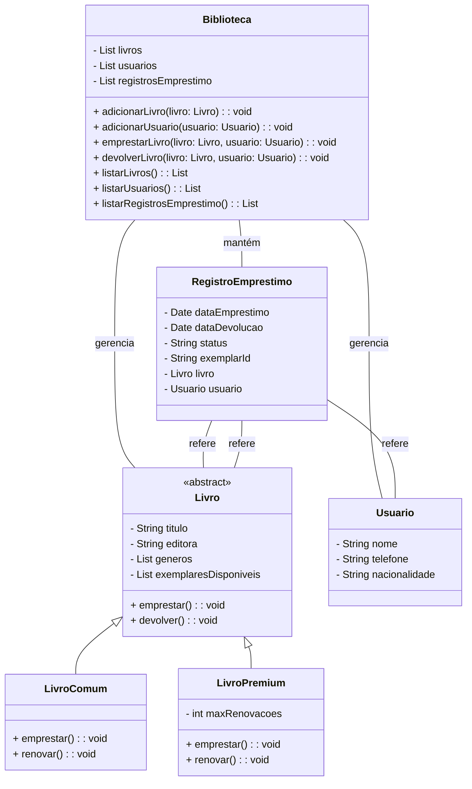

# 🏆 Exercicio de Orientação a Objetos com Python

## 📚 Gerenciamento de Biblioteca

**Criar um sistema orientado a objetos para representar um
sistema de biblioteca seguindo os requisitos abaixo:**

1. Cada livro pode ter um ou mais autores.
2. A biblioteca controla apenas o nome, o telefone e a nacionalidade
de cada usuário.
3. Cada livro tem um título, editora, uma lista de gêneros aos quais
pertence e uma lista de exemplares disponíveis.
4. Quando um exemplar é emprestado, ele é removido da lista de
exemplares disponíveis.
5. Alguns livros podem ter um número máximo de renovações
permitidas.
6. A biblioteca mantém um registro de todos os empréstimos
realizados, incluindo detalhes como data de empréstimo, data de
devolução e estado do exemplar (por exemplo, emprestado ou
devolvido).
Para modelar o sistema, utilize obrigatoriamente os conceitos de classe,
herança, propriedade, encapsulamento e classe abstrata.

> **Nota:** Para modelar o sistema, utilize obrigatoriamente os conceitos de classe, herança, propriedade, encapsulamento e classe abstrata.

## Diagrama

