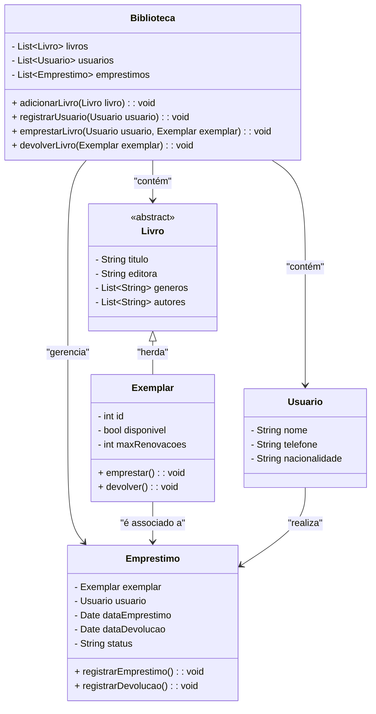

# 📚 Gerenciamento de Biblioteca 📚

## Requisitos

> 💡 Vamos criar um sistema orientado a objetos para representar um sistema de biblioteca seguindo os requisitos abaixo:

1. [ ] Cada livro pode ter um ou mais autores.
2. [ ] A biblioteca controla apenas o nome, o telefone e a nacionalidade de cada usuário.
3. [ ] Cada livro tem um título, editora, uma lista de gêneros aos quais pertence e uma lista de exemplares disponíveis.
4. [ ] Quando um exemplar é emprestado, ele é removido da lista de exemplares disponíveis.
5. [ ] Alguns livros podem ter um número máximo de renovações permitidas.
6. [ ] A biblioteca mantém um registro de todos os empréstimos realizados, incluindo detalhes como data de empréstimo, data de devolução e estado do exemplar (por exemplo, emprestado ou devolvido).

> 🖋️ **Nota:**  _Para modelar o sistema, utilize obrigatoriamente os conceitos de classe, herança, propriedade, encapsulamento e classe abstrata._

## 🛠️ Modelando o Sistema

O sistema de gerenciamento de biblioteca é modelado para gerenciar livros, usuários e empréstimos. A classe Biblioteca centraliza a administração de livros, usuários e registros de empréstimos.

**Livro:** Classe abstrata que contém informações sobre o livro, como título, editora, gêneros e autores. Também define métodos para emprestar e devolver livros.

**Exemplar:** Representa uma cópia física do livro. Inclui informações sobre a disponibilidade e o número máximo de renovações permitidas.

**Usuario:** Armazena dados básicos dos usuários da biblioteca, como nome, telefone e nacionalidade.

**Emprestimo:** Registra os detalhes dos empréstimos, incluindo o exemplar emprestado, o usuário, a data de empréstimo, a data de devolução e o status do empréstimo.

>O sistema permite adicionar novos livros e usuários, registrar empréstimos e devoluções, e manter um histórico detalhado dos empréstimos realizados.(Opicional)

**O diagrama UML abaixo modela o sistema de biblioteca, considerando os requisitos e conceitos solicitados:**

#### Análise do Diagrama UML

> O diagrama UML acima descreve a estrutura do sistema de gerenciamento de biblioteca, detalhando as principais classes e suas interações. Vamos analisar cada componente e como eles se relacionam:

1. **Biblioteca**

   **_Responsabilidade:_** Gerencia livros, usuários e registros de empréstimos.

   **_Atributos:_**
   - **livros:** Lista de objetos da classe `Livro` que representa todos os livros na biblioteca.
   - **usuarios:** Lista de objetos da classe `Usuario` que contém todos os usuários cadastrados.
   - **emprestimos:** Lista de objetos da classe `Emprestimo` que mantém o histórico de todos os empréstimos realizados.

   **_Métodos:_**
   - **adicionarLivro(Livro livro):** Adiciona um novo livro ao sistema.
   - **registrarUsuario(Usuario usuario):** Cadastra um novo usuário na biblioteca.
   - **emprestarLivro(Usuario usuario, Exemplar exemplar):** Realiza o empréstimo de um exemplar para um usuário.
   - **devolverLivro(Exemplar exemplar):** Registra a devolução de um exemplar.

2. **Livro (Classe Abstrata)**

   **_Responsabilidade:_** Representa um livro genérico com informações comuns.

   **_Atributos:_**
   - **titulo:** O título do livro.
   - **editora:** A editora do livro.
   - **generos:** Lista de gêneros aos quais o livro pertence.
   - **autores:** Lista de autores do livro.

   **_Métodos:_**
   - **emprestar():** Método abstrato para emprestar o livro.
   - **devolver():** Método abstrato para devolver o livro.

   **_Observação:_** Esta é uma classe abstrata, o que significa que não pode ser instanciada diretamente. Suas subclasses devem implementar os métodos abstratos.

3. **Exemplar**

   **_Responsabilidade:_** Representa uma cópia física do livro.

   **_Atributos:_**
   - **id:** Identificador único do exemplar.
   - **disponivel:** Indica se o exemplar está disponível para empréstimo.
   - **maxRenovacoes:** Número máximo de vezes que o exemplar pode ser renovado.

   **_Métodos:_**
   - **emprestar():** Atualiza o status do exemplar para indicar que está emprestado.
   - **devolver():** Atualiza o status do exemplar para indicar que foi devolvido.

4. **Usuario**

   **_Responsabilidade:_** Armazena as informações dos usuários da biblioteca.

   **_Atributos:_**
   - **nome:** Nome do usuário.
   - **telefone:** Número de telefone do usuário.
   - **nacionalidade:** Nacionalidade do usuário.

5. **Emprestimo**

   **_Responsabilidade:_** Registra os detalhes de um empréstimo.

   **_Atributos:_**
   - **exemplar:** Referência ao exemplar emprestado.
   - **usuario:** Referência ao usuário que realizou o empréstimo.
   - **dataEmprestimo:** Data em que o empréstimo foi realizado.
   - **dataDevolucao:** Data em que o exemplar foi devolvido.
   - **status:** Status do empréstimo (emprestado, devolvido, etc.).

   **_Métodos:_**
   - **registrarEmprestimo():** Registra um novo empréstimo no sistema.
   - **registrarDevolucao():** Registra a devolução de um exemplar.

**Relacionamentos entre as Classes:**

- **Biblioteca e Livro:** A classe `Biblioteca` possui uma associação com a classe `Livro`, indicando que ela gerencia uma lista de livros.
- **Biblioteca e Usuario:** A classe `Biblioteca` também gerencia a lista de usuários, estabelecendo uma associação com a classe `Usuario`.
- **Biblioteca e Emprestimo:** A classe `Biblioteca` mantém um histórico de empréstimos, associando-se à classe `Emprestimo`.
- **Livro e Exemplar:** A classe `Livro` é estendida pela classe `Exemplar`, que representa uma cópia específica do livro. A Classe `Livro` é uma classe abstrata que define características comuns de todos os livros. A classe `Exemplar` herda essas características e adiciona atributos específicos para gerenciar cópias individuais do livro, como identificação e disponibilidade.
- **Exemplar e Emprestimo:** A classe `Exemplar` está associada à classe `Emprestimo`, indicando que cada exemplar pode ser emprestado e retornado.
- **Usuario e Emprestimo:** A classe `Usuario` está associada à classe `Emprestimo`, registrando quais usuários realizaram quais empréstimos.

#### Aplicação dos Conceitos de Classes, Classe Abstrata e Herança no Sistema de Gerenciamento da Biblioteca

1. **Classes**
   No sistema de gerenciamento da biblioteca, as classes representam diferentes entidades e suas funcionalidades:

   - **Classe Biblioteca:** É a classe principal que gerencia a coleção de livros, usuários e registros de empréstimos. Possui métodos para adicionar livros, registrar usuários, emprestar livros e devolver livros.
   - **Classe Livro:** Representa um livro em geral, com atributos como título, editora, gêneros e autores. Serve como base para outras classes específicas.
   - **Classe Exemplar:** Representa uma cópia específica de um livro, com atributos como ID e disponibilidade, e métodos para emprestar e devolver o exemplar.
   - **Classe Usuario:** Representa um usuário da biblioteca, com atributos como nome, telefone e nacionalidade.
   - **Classe Emprestimo:** Gerencia o processo de empréstimo, incluindo informações sobre o exemplar, o usuário, as datas e o status do empréstimo.

2. **Classe Abstrata**
   - **Classe Livro:** A classe `Livro` é abstrata e não pode ser instanciada diretamente. Define atributos e métodos comuns para todos os tipos de livros, que devem ser implementados por classes concretas que herdam dela.

3. **Herança**
   - **Livro <|-- Exemplar:** A classe `Exemplar` herda da classe `Livro`, significando que `Exemplar` é uma especialização de `Livro`. Isso permite que `Exemplar` reutilize os atributos e métodos da classe `Livro`, além de adicionar suas próprias características e funcionalidades.
